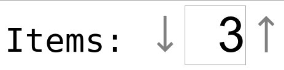

# react-decinc

[![Commitizen friendly][commitizen-image]][commitizen-url]
[![XO code style][codestyle-image]][codestyle-url]

[![NPM version][npm-image]][npm-url]
[![Build Status][travis-image]][travis-url]
[![Dependency Status][depstat-image]][depstat-url]
[![DevDependency Status][depstat-dev-image]][depstat-dev-url]

> React decrement/increment input component



## Install

```
npm install --save react-decinc
```

## Usage
See: [example](example/app.jsx)

```js
class App extends React.Component {
    constructor() {
        super();
        this.state = {
            count: 33,
            gramm: 0.15
        };
        this.handleChangeCount = this.handleChangeCount.bind(this);
        this.handleChangeGramm = this.handleChangeGramm.bind(this);
    }

    handleChangeCount(value) {
        this.setState({count: value});
    }

    handleChangeGramm(value) {
        this.setState({gramm: value});
    }

    render() {
        return (
            <div
                style={{
                    fontSize: '500%',
                    fontFamily: 'monospace'
                }}
                >
                <div>
                    <label>
                        <small>{'Count: '}</small>
                        <DecInc
                            className="dec-inc_theme_example"
                            value={this.state.count}
                            max={33}
                            min={0}
                            onChange={this.handleChangeCount}
                            />
                    </label>
                </div>
                <div>
                    <label>
                        <small>{'Gramm: '}</small>
                        <DecInc
                            className="dec-inc_theme_example"
                            value={this.state.gramm}
                            min={0}
                            step={0.001}
                            onChange={this.handleChangeGramm}
                            />
                    </label>
                </div>
            </div>
        );
    }
}

ReactDOM.render(<App/>, document.getElementById('app'));
```

## Api

```js
DecInc.propTypes = {
    value: React.PropTypes.number,
    min: React.PropTypes.number,
    max: React.PropTypes.number,
    step: React.PropTypes.number,
    disabled: React.PropTypes.bool,
    className: React.PropTypes.string,
    onChange: React.PropTypes.func
};
DecInc.defaultProps = {
    step: 1,
    disabled: false
};
```

## License

MIT © [Vladimir Rodkin](https://github.com/VovanR)

[commitizen-url]: http://commitizen.github.io/cz-cli/
[commitizen-image]: https://img.shields.io/badge/commitizen-friendly-brightgreen.svg?style=flat-square

[codestyle-url]: https://github.com/sindresorhus/xo
[codestyle-image]: https://img.shields.io/badge/code_style-XO-5ed9c7.svg?style=flat-square

[npm-url]: https://npmjs.org/package/react-decinc
[npm-image]: https://img.shields.io/npm/v/react-decinc.svg?style=flat-square

[travis-url]: https://travis-ci.org/VovanR/react-decinc
[travis-image]: https://img.shields.io/travis/VovanR/react-decinc.svg?style=flat-square

[depstat-url]: https://david-dm.org/VovanR/react-decinc
[depstat-image]: https://david-dm.org/VovanR/react-decinc.svg?style=flat-square

[depstat-dev-url]: https://david-dm.org/VovanR/react-decinc
[depstat-dev-image]: https://david-dm.org/VovanR/react-decinc/dev-status.svg?style=flat-square
