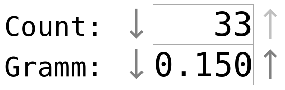

# react-decinc

[![Commitizen friendly][commitizen-image]][commitizen-url]
[![XO code style][codestyle-image]][codestyle-url]

[![NPM version][npm-image]][npm-url]
[![Build Status][travis-image]][travis-url]
[![Dependency Status][depstat-image]][depstat-url]
[![DevDependency Status][depstat-dev-image]][depstat-dev-url]

> React decrement/increment input component



## Install

```
npm install --save react-decinc
```

## Usage

```js
import DecInc from 'react-decinc';

class App extends React.Component {
	constructor() {
		super();
		this.state = {value: 0};
		this.handleChange = this.handleChange.bind(this);
	}

	handleChange(value) {
		this.setState({value: value});
	}

	render() {
		return (
			<div>
				<small>{'Items: '}</small>
				<DecInc
					value={this.state.value}
					max={10}
					min={0}
					onChange={this.handleChange}
					/>
			</div>
		);
	}
}

ReactDOM.render(<App/>, document.getElementById('app'));
```

## License

MIT © [Vladimir Rodkin](https://github.com/VovanR)

[commitizen-url]: http://commitizen.github.io/cz-cli/
[commitizen-image]: https://img.shields.io/badge/commitizen-friendly-brightgreen.svg?style=flat-square

[codestyle-url]: https://github.com/sindresorhus/xo
[codestyle-image]: https://img.shields.io/badge/code_style-XO-5ed9c7.svg?style=flat-square

[npm-url]: https://npmjs.org/package/react-decinc
[npm-image]: https://img.shields.io/npm/v/react-decinc.svg?style=flat-square

[travis-url]: https://travis-ci.org/VovanR/react-decinc
[travis-image]: https://img.shields.io/travis/VovanR/react-decinc.svg?style=flat-square

[depstat-url]: https://david-dm.org/VovanR/react-decinc
[depstat-image]: https://david-dm.org/VovanR/react-decinc.svg?style=flat-square

[depstat-dev-url]: https://david-dm.org/VovanR/react-decinc
[depstat-dev-image]: https://david-dm.org/VovanR/react-decinc/dev-status.svg?style=flat-square
